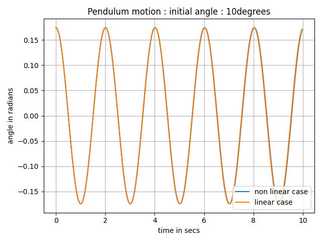
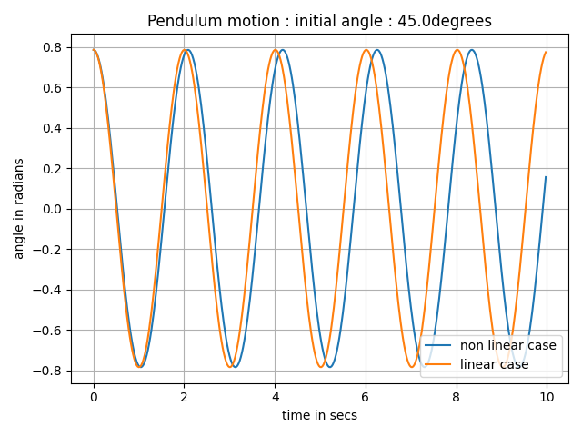
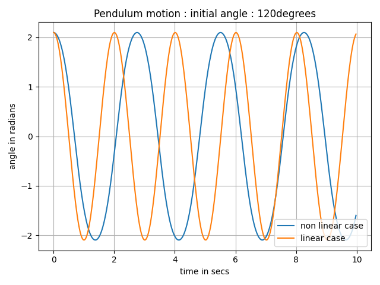

# PendulumProject

Description: 
First project using Python to model non linear and linear pendulum motions. 

Usage:
The initial theta value can be changed. 
This allows users to model the effects of different initial angular displacement on non linear and linear pendulum motions.

For example:

